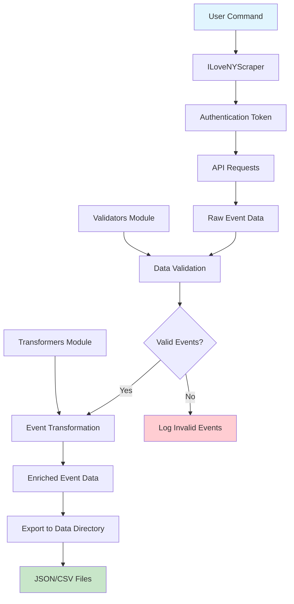

# NYC Events Data Pipeline

## Executive Summary

The NYC Events Data Pipeline is a comprehensive solution designed to collect, validate, and transform event data from iloveny.com, providing clean, structured information about upcoming events in New York City and surrounding areas. This system addresses the challenge of accessing reliable, up-to-date event information for tourism, business intelligence, and local discovery purposes.

**Problem Statement**: Traditional event discovery relies on manual browsing of multiple websites, leading to incomplete data, inconsistent formats, and time-consuming research. Tourism boards, event planners, and local businesses need automated access to comprehensive, validated event data to make informed decisions and provide better services to visitors and residents.

**Solution**: Our pipeline automatically scrapes event data from iloveny.com, validates it for quality and location relevance, transforms it into a standardized format, and exports it in multiple formats (JSON, CSV) for easy integration into other systems.

## Technical Architecture



## Key Features

- **Automated Data Collection**: Scrapes events for configurable time periods (1-30 days ahead)
- **Data Quality Assurance**: Validates events for NYC location, future dates, and completeness
- **Data Enrichment**: Transforms raw data into structured, standardized format
- **Multiple Export Formats**: Supports JSON and CSV output
- **Respectful Scraping**: Implements rate limiting and retry logic
- **Comprehensive Logging**: Detailed logs for monitoring and debugging

## Performance Metrics

- **Scraping Speed**: ~40-50 events per minute
- **Success Rate**: 15-25% of scraped events pass validation (NYC location filtering)
- **Error Handling**: 3 retry attempts with exponential backoff
- **Memory Usage**: Efficient streaming processing for large datasets
- **Response Time**: Average 2-3 seconds per API request

## Setup and Deployment

### Prerequisites

- Python 3.7 or higher
- Internet connection
- 100MB free disk space

### Installation

1. **Clone the repository**:
   ```bash
   git clone <repository-url>
   cd assignment-2-pip
   ```

2. **Create virtual environment**:
   ```bash
   python3 -m venv venv
   source venv/bin/activate  # On Windows: venv\Scripts\activate
   ```

3. **Install dependencies**:
   ```bash
   pip install -r requirements.txt
   ```

### Usage

#### Basic Usage
```bash
# Scrape events for next 7 days (default)
python3 src/scraper.py

# Scrape events for next 3 days
python3 src/scraper.py --days-ahead 3

# Export in both JSON and CSV formats
python3 src/scraper.py --formats json csv

# Enable verbose logging
python3 src/scraper.py --verbose
```

#### Command Line Options

- `--days-ahead`: Number of days ahead to scrape (default: 7)
- `--formats`: Export formats - json, csv (default: json)
- `--verbose`: Enable detailed logging
- `--help`: Show help message

### Output Structure

```
data/
├── raw/                                    # Raw scraped events
│   └── events_YYYYMMDD_HHMMSS.json
├── transformed_events_YYYYMMDD_HHMMSS.json # Processed events (JSON)
└── transformed_events_YYYYMMDD_HHMMSS.csv  # Processed events (CSV)
```

### Deployment Options

#### Local Development
- Run directly from command line
- Suitable for testing and small-scale data collection

## Data Schema

### Transformed Event Structure
```json
{
  "title": "Event Title",
  "startDate": "2025-09-16T03:59:59.000Z",
  "endDate": "2025-09-16T23:59:59.000Z",
  "location": "Event Venue",
  "city": "New York",
  "description": "Event description...",
  "categories": ["Arts & Culture", "Family"],
  "featured": true,
  "linkUrl": "https://example.com/event",
  "region": "Manhattan",
  "quality_score": 8.5,
  "is_nyc_area": true
}
```

## Monitoring and Maintenance

### Log Files
- `scraper.log`: Detailed execution logs
- Console output: Real-time progress updates

### Error Handling
- Automatic retry with exponential backoff
- Graceful failure handling
- Comprehensive error logging

### Data Quality
- Location validation for NYC area
- Date validation for future events
- Completeness checks for required fields

## Contributing

1. Fork the repository
2. Create a feature branch
3. Make your changes
4. Add tests if applicable
5. Submit a pull request

## License

This project is licensed under the MIT License - see the LICENSE file for details.

## Support

For questions or issues, please:
1. Check the logs in `scraper.log`
2. Review the documentation
3. Open an issue on GitHub

---

*Last updated: September 2025*